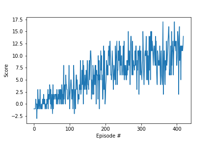
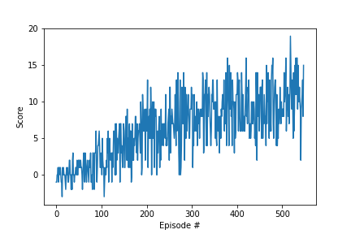
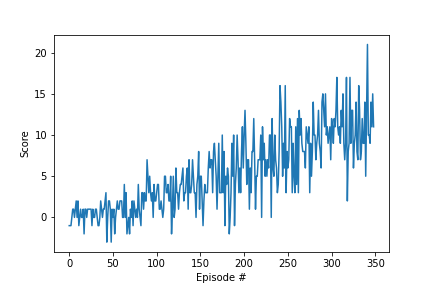

# Project Report for DQN Banana Environment Project

## Learning Algorithm

### Baseline Model

- Fully connected layer - Input: 37 (state size), Output: 64
- Fully connected layer - Input: 64, Output: 64
- Fully connected layer - Input: 64, Output: (action size)

The DQN algorithm was trained with the following hyperparameters:

- Maximum steps per episode: 1000
- Starting epsilon: 1.0
- Ending epsilon: 0.01
- Epsilon decay rate: 0.995

During the initial training, the following hyperparameters were used:

- BUFFER_SIZE = int(1e5)  
- BATCH_SIZE = 64         
- GAMMA = 0.99            
- TAU = 1e-3              
- LR = 5e-4               
- UPDATE_EVERY = 4    

### Experimental Model

- Fully connected layer - Input: 37 (state size), Output: 128
- Fully connected layer - Input: 128, Output: 64
- Fully connected layer - Input: 64, Output: 64
- Fully connected layer - Input: 64, Output: (action size)

The DQN algorithm was trained with the following hyperparameters:

- Maximum steps per episode: 1000
- Starting epsilon: 1.0
- Ending epsilon: 0.01
- Epsilon decay rate: 0.995

During the initial training, the following hyperparameters were used:

- BUFFER_SIZE = int(1e5)  
- BATCH_SIZE = 64         
- GAMMA = 0.99            
- TAU = 1e-3              
- LR = 5e-4               
- UPDATE_EVERY = 4 

### Dueling QNetwork Model

- Fully connected layer - Input: 37 (state size), Output: 128
- Fully connected layer - Input: 128, Output: 64
- Fully connected layer - Input: 64, Output: 64
- Dueling Stream (Advantage Stream) - Input: 64, Output: (action size)
- Dueling Stream (Value Stream) - Input: 64, Output: 1

The DQN algorithm was trained with the following hyperparameters:

- Maximum steps per episode: 1000
- Starting epsilon: 1.0
- Ending epsilon: 0.01
- Epsilon decay rate: 0.995

During the initial training, the following hyperparameters were used:

- BUFFER_SIZE = int(1e5)  
- BATCH_SIZE = 64         
- GAMMA = 0.99            
- TAU = 1e-3              
- LR = 5e-4               
- UPDATE_EVERY = 4 

### Conclusion

| Architecture | Average Training Time | Episodes | Average Score (Training) | Average Score (Inference) | Plot |
|--------------|-----------------------|----------|------------------------|-------------------------|------|
| Baseline | 702.239 | 319 | 10.05 | 6.2 |  |
| Experimental | 937.072 | 448 | 10.00 | 1.4 |  |
| Dueling QNetwork | 631.126 | 249 | 10.06 | 5.4 |  |

- The reason for testing the architecture with additional layers was to potentially increase the capacity of the neural network and enable it to learn more complex representations of the environment. According to the results, it perfomed worse than the baseline three layer architecture.
- Dueling QNetwork had faster convergence than the QNetwork.
- Moving forward with the baseline QNetwork.

## Results

### Hyperparameter Tuning Results

The following table summarizes the results from hyperparameter tuning:

| Training Session | Replay Buffer Size | Batch Size | Starting Epsilon | Update Frequency | Gamma | Tau | Average Training Time | Episodes to Solve | Average Score at Convergence | Average Score | Plot |
|------------------|--------------------|------------|------------------|------------------|-------|-----|-----------------------|-------------------|-----------------------------|
| 1 | int(1e5) | 64 | 1.0 | 4 | 0.99 | 1e-3 | 766.229 | 356 | 10.01 | 1.4 |  |
| 2 | int(1e4) | 128 | 1.0 | 8 | 0.99 | 1e-3 | 761.174 | 407 | 10.03 | 6.8 |  |
| 3 | int(1e5) | 128 | 1.0 | 4 | 0.99 | 1e-3 | 718.573 | 307 | 10.00 | 4.4 |  |
| 4 | int(1e6) | 256 | 1.0 | 4 | 0.99 | 1e-3 | 968.525 | 458 | 10.03 | 2.2 |  |
| 5 | int(1e6) | 128 | 1.0 | 2 | 0.99 | 1e-3 | --- | 2000 | --- | --- |  |
| 6 | int(1e5) | 128 | 1.0 | 8 | 0.99 | 1e-3 | 700.502 | 374 | 10.06 | 5.6 |  |
| 7 | int(1e5) | 128 | 1.0 | 16 | 0.99 | 1e-3 | 775.411 | 526 | 10.07 | 5.6 |  |

By performing hyperparameter tuning and retraining the model multiple times, I successfully improved the agent's performance in the Banana Environment. The chosen hyperparameters for the third training session resulted in the fastest training time and achieved the highest average score at convergence.

## Ideas for Future Work

1. More Extensive Hyperparameter Optimization: Continue exploring hyperparameter space with advanced optimization techniques to find even better combinations that result in faster convergence and higher rewards.

2. Prioritized Experience Replay: Implement prioritized experience replay to focus on important experiences that contribute more to learning, potentially accelerating the agent's learning process.

3. Learning from Pixels: Investigate learning directly from raw pixels as input to enable the agent to process visual information directly, which may lead to improved performance and generalization in more complex environments.

4. Prioritized Dueling Double Deep Q Networks (PD3QN): Combine the benefits of prioritized experience replay, dueling architecture, and double DQN for a more robust and efficient learning process.

By pursuing these future ideas, I aim to further advance the performance and capabilities of the DQN agent in the Banana Environment.

--- End of Report ---

